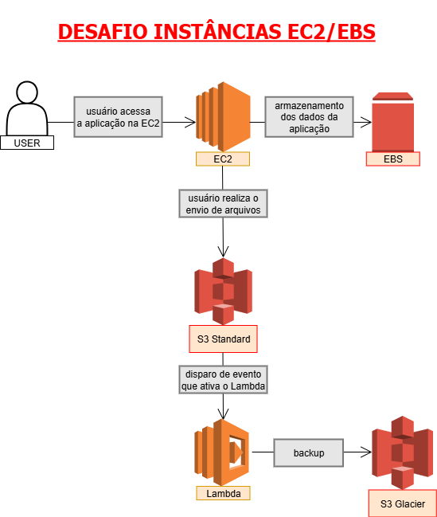

# Desafio de Gerenciamento de Instâncias EC2 na AWS

Este repositório foi criado para documentar os estudos e a prática realizada durante o laboratório de AWS Cloud Foundations. O foco do projeto é a configuração de máquinas virtuais, gestão de armazenamento e aplicação de boas práticas de economia na nuvem.

## Conteúdo Técnico

### 1. Infraestrutura e Segurança
A base de qualquer projeto na AWS exige o entendimento da infraestrutura global, dividida em Regiões e Zonas de Disponibilidade. Durante o laboratório, foram aplicados conceitos de:
* **IAM (Identity and Access Management):** Criação de usuários e grupos para evitar o uso da conta raiz.
* **Security Groups:** Configuração de firewalls virtuais para liberar apenas as portas necessárias (como HTTP/22 para SSH).

### 2. Computação com Amazon EC2
O EC2 (Elastic Compute Cloud) representa a capacidade computacional escalável na nuvem.
* **Modelo IaaS:** Como Infraestrutura como Serviço, o usuário detém a responsabilidade sobre o sistema operacional, dados e aplicações.
* **Componentes:** Definição de CPU, Memória, Disco e Rede para cada instância.
* **Acesso:** Gerenciamento realizado via Console AWS, AWS CLI e Cloud Shell.

### 3. Soluções de Armazenamento
Diferenciação prática entre os serviços de armazenamento:
* **Amazon EBS (Elastic Block Store):** Armazenamento de blocos anexado diretamente às instâncias, ideal para bancos de dados e logs.
* **Amazon S3 (Simple Storage Service):** Armazenamento de objetos com alta escalabilidade. Foram exploradas as Classes de Armazenamento e as Regras de Ciclo de Vida (Lifecycle) para redução automática de custos.

### 4. Otimização de Custos e Escalabilidade
Aprendizado focado em evitar gastos desnecessários através de:
* **Escalabilidade:** Diferença entre escala Vertical (recursos da máquina) e Horizontal (número de instâncias).
* **Modelos de Compra:** Uso de instâncias On-Demand, Reservadas e Spot (com até 90% de desconto).
* **Higiene de Recursos:** Remoção de recursos ociosos e desligamento de máquinas em ambientes de teste.

## Ferramentas Utilizadas
* Console de Gerenciamento AWS
* AWS CLI
* Git Bash

---
Documentação desenvolvida como parte do desafio de projeto na plataforma DIO.
